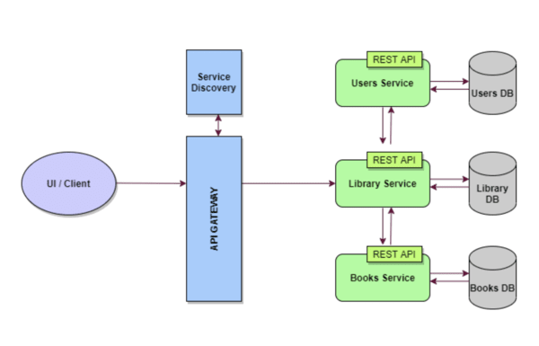

# Library Management Microservices

This project demonstrates a microservices-based architecture for a Library Management System. It includes three main services: User Service, Book Service, and Library Service. Additionally, it employs various microservices patterns and tools such as Eureka for service discovery, Feign for declarative HTTP client, and an API Gateway for routing requests.

## High-level Architecture




### Service Interactions:

- **API Gateway**: Single entry point for all clients.
- **Service Discovery**: Using Eureka for dynamic service registration and discovery.
- **Feign**: Declarative HTTP client for inter-service communication.
- **Ribbon**: Client-side load balancing.
- **Hystrix**: Circuit breaker pattern for fault tolerance.
- **Config Service**: Centralized configuration management.

## User Service

Manages user-related operations.

### UserEntity:
- **username**: String
- **email**: String
- **name**: String

### Endpoints:
- `GET /users` : List of all users
- `GET /users/{username}` : Get user by username
- `POST /users` : Add a user
- `DELETE /users/{username}` : Delete a user
- `PUT /users/{username}` : Update a user

## Book Service

Manages book-related operations.

### BookEntity:
- **id**: Long
- **name**: String
- **publisher**: String
- **author**: String

### Endpoints:
- `GET /books` : List of all books
- `GET /books/{book_id}` : Get book by id
- `POST /books` : Add a book
- `DELETE /books/{book_id}` : Delete a book
- `PUT /books/{book_id}` : Update a book

## Library Service

Handles the interaction between users and books, acting as an intermediary.

### LibraryEntity:
- **id**: Long
- **username**: String
- **bookId**: Long

### Endpoints:
- `GET /library/books` : List of all books (Calls book service GET /books)
- `GET /library/books/{bookId}` : Get a book's details (Calls book service GET /books/{bookId})
- `POST /library/books/{bookId}` : Add a new book (Calls book service POST /books/{bookId})
- `PUT /library/books/{bookId}` : Update book details (Calls book service PUT /books/{book_id})
- `DELETE /library/books/{bookId}` : Delete a book (Calls book service DELETE /books/{bookId})
- `GET /library/users` : List of all users (Calls user service GET /users)
- `GET /library/users/{username}` : View user profile with all issued books (Calls user service GET /users/{username}, fetches book ids from library table and calls GET /books/{book_id})
- `POST /library/users` : Add a user (Calls user service POST /users)
- `DELETE /library/users/{username}` : Delete user (Release all books for that user_id in library table and calls DELETE users/{username})
- `PUT /library/users/{username}` : Update user's account details (Calls PUT users/{username})
- `POST /library/users/{username}/books/{bookId}` : Issue a book to a user (Updates library table with book-user association)
- `DELETE /library/users/{username}/books/{bookId}` : Release the book for the user_id (Delete book-user association in library table)

## Tools and Technologies Used

- **Spring Boot**
- **Spring Cloud Netflix (Eureka, Feign, Ribbon, Hystrix)**
- **Spring Cloud Config**
- **MySQL**
- **Maven**
- **Visual Studio Code**

## How to Run the Project

1. **Clone the repository**:
    ```sh
    git clone https://github.com/your-repository/library_management_service.git
    cd library_management_service
    ```

2. **Build the project**:
    ```sh
    mvn clean install
    ```

3. **Run Eureka Server**:
    ```sh
    cd eureka-server
    mvn spring-boot:run
    ```

4. **Run Config Server**:
    ```sh
    cd config-server
    mvn spring-boot:run
    ```

5. **Run API Gateway**:
    ```sh
    cd api-gateway
    mvn spring-boot:run
    ```

6. **Run User Service**:
    ```sh
    cd user-service
    mvn spring-boot:run
    ```

7. **Run Book Service**:
    ```sh
    cd book-service
    mvn spring-boot:run
    ```

8. **Run Library Service**:
    ```sh
    cd library-service
    mvn spring-boot:run
    ```

## Contributors

- [Sai Kalyan Maram](https://github.com/kalyansai1420)
- [Bharathi Baddi](https://github.com/BharathiBaddi)

## License

This project is licensed under the MIT License - see the [LICENSE.md](LICENSE.md) file for details.

